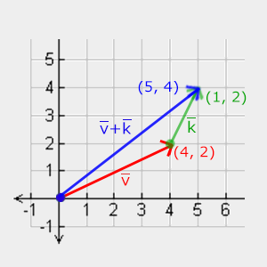

# Important Notes

## 🧊 Understanding Vectors and Matrices in Computer Graphics

### Introduction

This guide explains how we use vectors and matrices to transform objects in computer graphics. While these mathematical concepts might seem intimidating at first, they're powerful tools that become intuitive with practice.

### Vectors

### What is a Vector?

A vector represents both direction and magnitude (length). Think of it like GPS directions:

- "Drive east for 5 miles, then north for 3 miles"
- Here, "east" and "north" are directions, while "5 miles" and "3 miles" are magnitudes

Vectors can exist in any number of dimensions, but in graphics we typically use:

- 2D vectors for screen coordinates and textures
- 3D vectors for world positions and directions
- 4D vectors for certain transformations (homogeneous coordinates)

### Vector Operations

1. Scalar Operations

When we multiply a vector by a scalar (regular number), we multiply each component:

```
Vector × 2 = [3, 4, 5] × 2 = [6, 8, 10]
```

2. Vector Negation

Negating a vector reverses its direction:

```
-[3, 4, 5] = [-3, -4, -5]
```

3. Vector Addition and Subtraction

Adding vectors means combining their components:

```
[1, 2, 3] + [4, 5, 6] = [5, 7, 9]
```



Subtracting vectors gives us the difference between their positions:

```
[4, 5, 6] - [1, 2, 3] = [3, 3, 3]
```


4. Vector Length

We calculate a vector's length using the Pythagorean theorem:

```
length = √(x² + y² + z²)
```


5. Advanced Vector Operations

- Dot Product

The dot product helps us find angles between vectors and determine how aligned they are:

```
A · B = Ax × Bx + Ay × By + Az × Bz
```

Key properties:

- Results in a single number (scalar)
- If vectors are normalized (length = 1), dot product = cos(θ)
- Equals 1 when vectors align perfectly
- Equals 0 when vectors are perpendicular
- Equals -1 when vectors point in opposite directions

- Cross Product

The cross product creates a new vector perpendicular to both input vectors:

```
A × B = [
    Ay × Bz - Az × By,
    Az × Bx - Ax × Bz,
    Ax × By - Ay × Bx
]
```

Uses:

- Creating surface normals
- Establishing coordinate systems
- Computing rotations

### Matrices

### What is a Matrix?

A matrix is a grid of numbers that we use to transform vectors and points. Each type of transformation (rotation, scaling, etc.) has its own matrix format.

### Basic Matrix Operations

1. Matrix Addition and Subtraction

Matrices of the same size can be added or subtracted element by element:

```
| 1 2 |   | 5 6 |   | 6  8 |
| 3 4 | + | 7 8 | = | 10 12 |
```

2. Matrix-Scalar Multiplication

Multiply each element by the scalar:

```
    | 1 2 |   | 2 4 |
2 × | 3 4 | = | 6 8 |
```

3. Matrix-Matrix Multiplication

Multiply rows by columns:

```
| 1 2 |   | 5 6 |   | 1×5+2×7  1×6+2×8 |
| 3 4 | × | 7 8 | = | 3×5+4×7  3×6+4×8 |
```

### Transformation Matrices

1. Scale Matrix

```
| Sx  0  0 |
|  0 Sy  0 |
|  0  0 Sz |
```

- Sx: Scale factor for x-axis
- Sy: Scale factor for y-axis
- Sz: Scale factor for z-axis

2. Translation Matrix (4×4)

```
| 1  0  0  Tx |
| 0  1  0  Ty |
| 0  0  1  Tz |
| 0  0  0   1 |
```

- Tx: Distance to move along x-axis
- Ty: Distance to move along y-axis
- Tz: Distance to move along z-axis

3. Rotation Matrix (around Z-axis)

```
| cos(θ) -sin(θ)  0  0 |
| sin(θ)  cos(θ)  0  0 |
|   0       0     1  0 |
|   0       0     0  1 |
```

- θ: Rotation angle in radians

### Practical Tips

1. Order matters in matrix multiplication

   - Scaling then rotating gives different results than rotating then scaling
   - Generally, multiply matrices from right to left

2. Common combinations

   - Model matrix = Scale × Rotation × Translation
   - View matrix = Camera's inverse transformation
   - Projection matrix = Perspective or orthographic projection

3. Performance considerations
   - Combine multiple transformations into a single matrix when possible
   - Use 4×4 matrices for consistency, even for 2D transformations
   - Cache frequently used matrices (like the identity matrix)

While the math may look complex, modern graphics libraries handle most of the details. Focus on understanding the concepts, and the implementation will become natural with practice.

## ፨ Coordinate Systems

### The global picture

### Local space

### World space

### View space

### Clip space

### Orthographic projection

### Perspective projection
